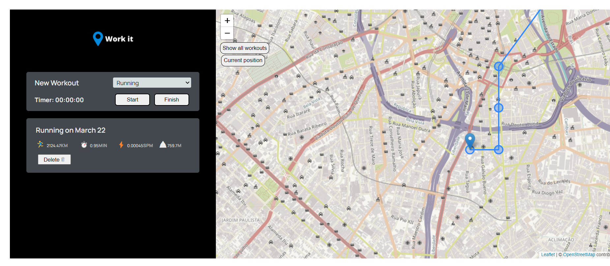
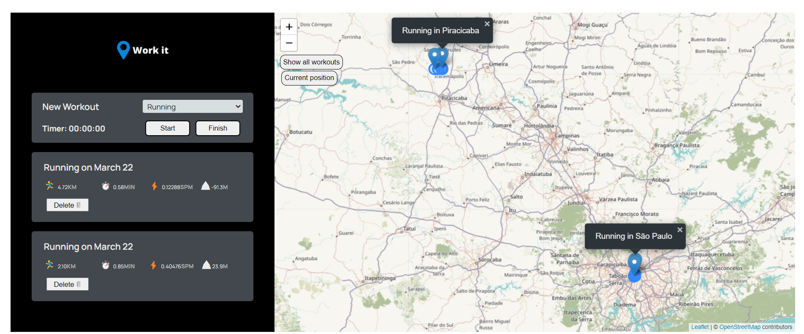

# WorkIt
Work it is a web-based platform that keeps track of users' workout activities, showing the path traveled on the map, activity time, average speed, and elevation gain. 

# Index
   * [About](#WorkIt)
   * [Index](#Index)
   * [Status](#Status)
   * [Features](#Features)
   * [Deploy](#Deploy-on-heroku)
   * [How to run](#How-to-run-the-aplication)
   * [Technologies](#Technologies)
   * [Author](#Author)
  

# Status
:construction: Under construction :construction:

# Features
- [x] A chronometer to measure workout activity time.
- [x] Get latitude and longitude in real time and render users position on the map.
- [x] Calculate distance traveled between several point with leaflet API.
- [x] Calculate elevation gain with leaflet-topography API.
- [x] Get users' location
- [x] Render workout data. 
- [x] Render workout path on the map.
- [x] Delete workouts.
- [x] Show all workouts paths at once.

# Deploy on netlify
https://worki-t.netlify.app/

# How to run the aplication

* Clone the repository. git clone https://github.com/STEFANOVIVAS/WorkIt your-destination-folder
* cd your-destination-folder
* npm install # installing the dependencies
* npm start # or 'node .'

# Technologies

- [Javascript](https://www.javascript.com/)
- [Node.JS](https://nodejs.org/en/)
- [Netlify](https://www.netlify.com/)
- [CSS]
- [HTML]

# Auhtor

[ Stefano Vivas](https://github.com/STEFANOVIVAS)

